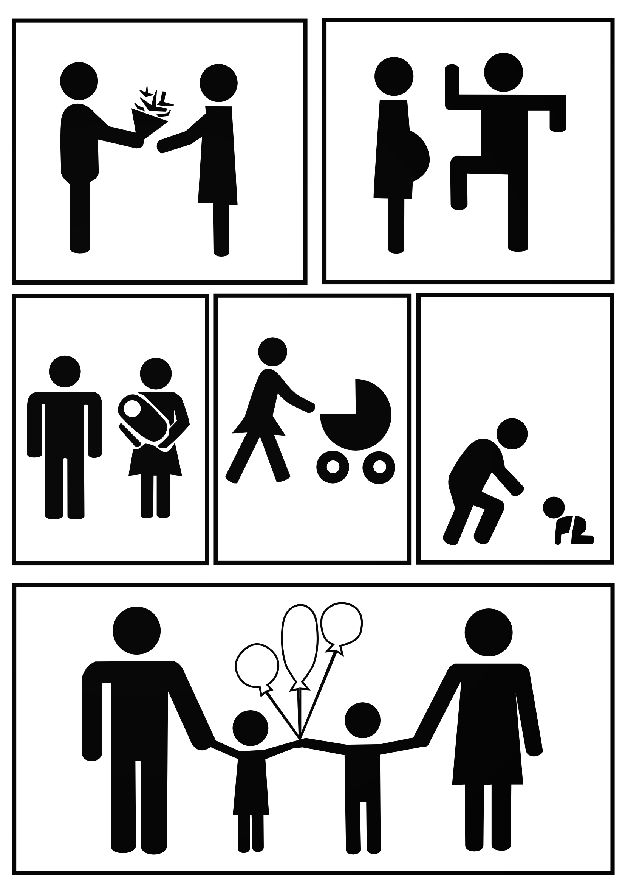

# 8vo Encuentro en Neuropsicología, 2019

*5 y 6 de septiembre, 2019 en la facultad de psicología UNAM*

## El laboratorio de neurocognición social, **NeurocogciaLab**, presenta los primeros resultados sobre **cognición social en maternidad** a la comunidad de la facultad de psicología durante el encuentro de neuropsicología, 2019!!!

**********

### Estamos muy contentos de compartir con ustedes nuestros intereses en la plática **Plasticidad neuronal, cognición social en la crianza** el jueves, 5 de septiembre, a las 16:00 hrs y el simposio **Primeros hallazgos de la cognición social en la maternidad**, viernes, 6 de septiembre, 2019 a las 16:00 hrs. 

**********

# Semana del cerebro, 2019

*del 11 al 17 de marzo, 2019 en la facultad de psicología UNAM*

## El laboratorio de neurocognición social, **NeurocogciaLab**, se presenta a la comunidad de la facultad de psicología durante la semana del cerebro, 2019!!!

**********

### Estamos muy contentos de compartir con ustedes nuestros intereses en investigación. 

**********

El humano como ser social realiza interacciones sociales en su cotidianidad para su adaptación y supervivencia. Los mecanismos cognitivos involucrados en las interacciones con los demás se han incluido en el término de `cognición social`.  

{: .center-image }

- Nos interesa evaluar funciones cognitivas sociales como empatía, teoría de la mente o mentalización:
    * EQ
    * IRI
    * Historia corta 
    * Tarea `empatom`

- Las emociones son una herramienta clave para nuestras interacciones sociales y también incluimos medidas de esto en nuestras investigaciones: 
    * identificación de expresiones emocionales en rostros

- También registramos medidas de estados emocionales como depresión y ansiedad.

- Una manera de afrontar actividades cotidianas-sociales que pueden ser desafiantes o, incluso, estresantes, son con nuestras estrategías cognitivas, pero el apoyo social ayuda mucho. Por eso medimos estrés y apoyo social:
    * escala de estres percibido 
    * escala de apoyo social 

Finalmente, también estamos interesados en estudiar el sustrato neurobiológico de la `cognición social`, *por eso somos **NeurocogciaLab**.*

{: .center-image }
