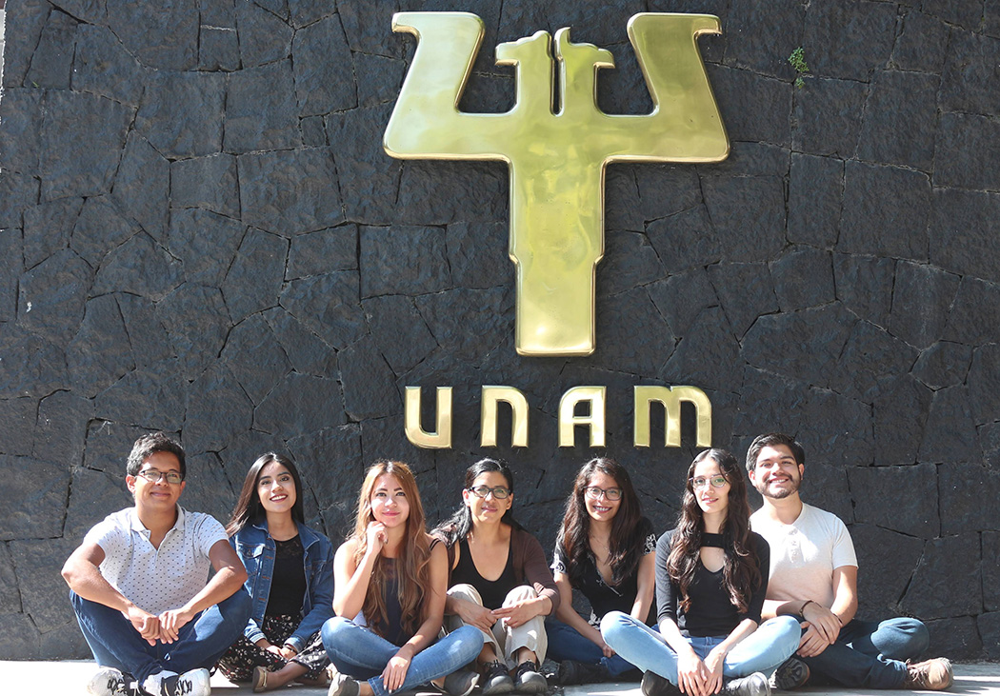

Somos un grupo de trabajo en la facultad de psicología de la UNAM en Ciudad Universitaria que estamos uniendo esfuerzo y conocimiento para contestar preguntas de investigación relacionadas a neurocognición social. Este esfuerzo involucra el uso de técnicas conductuales y de neuroimagen.
{: .center-image }

La investigación en el **Laboratorio de Neurocognición Social** abarca líneas de investigación asociadas a los procesos cognitivos y neurobiológicos durante las interacciones sociales en humanos:

  + ¿Cuáles son los mecanismos neurobiológicos de teoría de la mente y empatía?
  + ¿Qué mecanismos neuronales nos permiten identificar estímulos sociales específicos de nuestra cultura comparado con los de otras culturas?
  + ¿Cómo el cerebro procesa información contextual durante las interacciones sociales?
  + ¿Cuáles son los cambios neurobiológicos asociados a la reproducción, desde el embarazo, parto, lactancia y crianza?

Recabar información sobre estas grandes preguntas en psicología nos ayudará a conocer cómo el cerebro procesa información social en diferentes condiciones o contextos sociales, así como descifrar sus alteraciones en poblaciones clínicas (e.g. autismo, alexitimia, esquizofrenia).

Nuestras principales actividades como equipo de trabajo abarcan:
  + Construcción de tareas conductuales y paradigmas experimentales en estudios de neuroimagen (imagen por resonancia magnética funcional [IRMf]) para el estudios de procesos cognitivos asociados a la neurocognición social,
  + Adquisición y análisis de datos en estudios conductuales y de IRMf,
  + Discusión e interpretación de los hallazgos experimentales así como escritura de artículos especializados y de divulgación.
