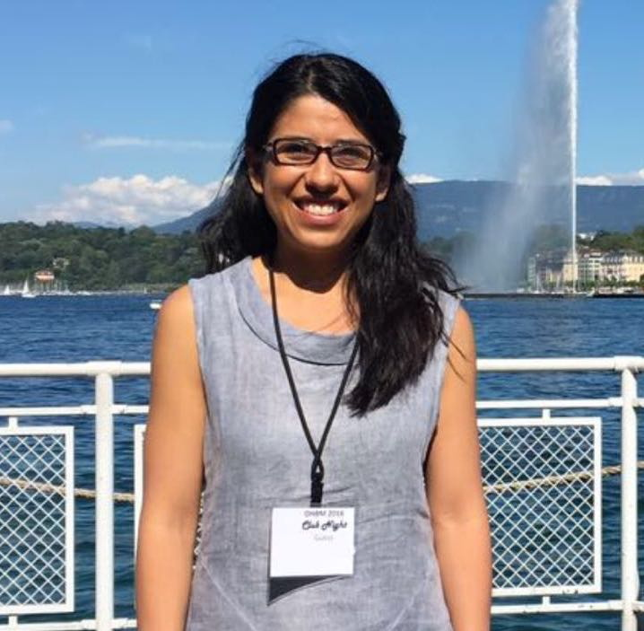
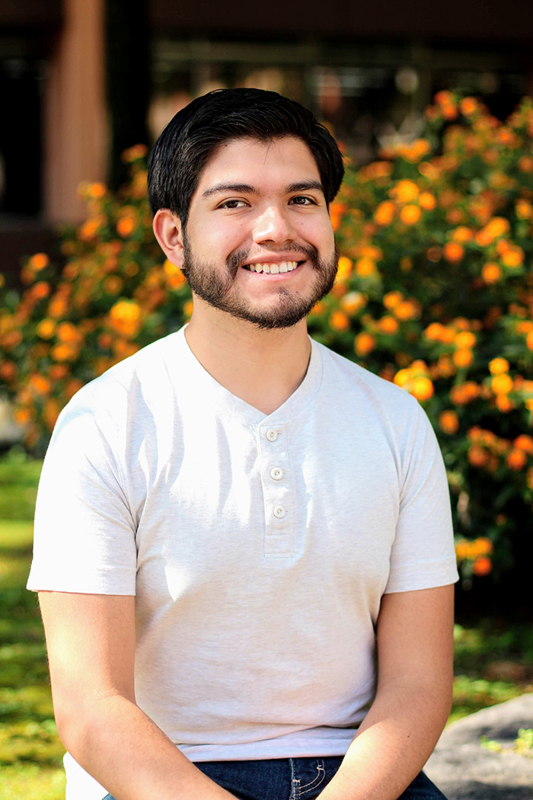

## Azalea Reyes Aguilar
{: .member-name }

### Profesora
{: .member-title}

{: .center-image }

#### Intereses en investigación:
{: .member-interest }

Neurociencias cognitivas, sociales y afectivas. Actualmente me interesa estudiar los cambios neurocognitivos sociales y
emocionales asociados a la experiencia reproductiva.

<i class="fas fa-envelope"></i> <azaleara@comunidad.unam.mx>    &nbsp;&nbsp; <i class="fas fa-envelope"></i> <azalea@neurocogcialab.org>

[<i class="fab fa-twitter-square fa-2x"></i>](https://twitter.com/azaleareyaguila)
[<i class="fab fa-github fa-2x"></i>](https://github.com/azaleara)
[<i class="fab fa-linkedin fa-2x"></i>](https://www.linkedin.com/in/azalea-reyes-aguilar-5a328b70)
[<i class="fab fa-researchgate fa-2x"></i>](https://www.researchgate.net/profile/Azalea_Reyes_Aguilar)

**********

## Karla Angélica Vargas Reyes
{: .member-name}
### Tesista, Licenciatura en psicología
{: .member-title}
{: .center-image }

#### Intereses en investigación:
{: .member-interest }

Egresada de la Facultad de Psicología, UNAM. Realizó una Estancia de Investigación en el Instituto de Investigación Biomédica de Cádiz (INIBICA), España; en donde colaboró en un proyecto relacionado con el registro de señales electrofisiológicas en humanos, en colaboración con la Universidad Loyola Andalucía (ULA). Actualmente realiza su tesis de grado en Empatía y Personalidad. Áreas de interés: Neurocognición, empatía, lenguaje.

<i class="fas fa-envelope"></i> <karlangvary@outlook.com>

**********

## Diana Mendez
{: .member-name}
### Tesista, Licenciatura en psicología
{: .member-title}

#### Intereses en investigación:
{: .member-interest }
Enfermedades neurodegenerativas, psiquiátricas, neuropsicología.

<i class="fas fa-envelope"></i> <dianalaurams@hotmail.com>

**********

## Elizabeth Vázquez
{: .member-name}
### Tesista, Licenciatura en psicología
{: .member-title}

#### Intereses en investigación:
{: .member-interest }
Neuropsicología, neurociencias cognitivas, enfermedades neurodegenerativas y lenguaje.

<i class="fas fa-envelope"></i> <elizabeth.97.vz@gmail.com>

**********

## Ana Karen Rodríguez Chávez
{: .member-name}
### Servicio Social, Licenciatura en psicología
{: .member-title}
{: .center-image }

#### Intereses en investigación:
{: .member-interest }
Neurobiología de las adicciones y de las emociones; enfermedades neurodegenerativas y del neurodesarrollo; neurobiología de la conducta social modulada por diferentes contextos.

<i class="fas fa-envelope"></i> <neurokapsi@gmail.com>

**********

## César Daniel Rodríguez Martínez
{: .member-name}
### Servicio Social, Licenciatura en psicología
{: .member-title}
{: .center-image }

#### Intereses en investigación:
{: .member-interest }
Traumatismo craneoencefálico; psicofisiologia, electroencefalografia y potenciales relacionados a eventos.

<i class="fas fa-envelope"></i> <cesar.rdz.psic@gmail.com>

**********

## Emma Yolotzin Botello Estrada
{: .member-name}
### Servicio Social, Licenciatura en psicología
{: .member-title}
{: .center-image }

#### Intereses en investigación:
{: .member-interest }
Neurociencias sociales y afectivas. Con particular interés en las bases neurobiológicas  de la empatía, las emociones y la regulación emocional.

<i class="fas fa-envelope"></i> <emma.ybe.1609@gmail.com>

**********

## Oscar Roa
{: .member-name}
### Prácticas en investigación, Licenciatura en psicología
{: .member-title}
{: .center-image }

#### Intereses en investigación:
{: .member-interest }
Mejora (neuroenhancement) de procesos y habilidades cognitivas (e.g. memoria) en personas sanas, modelado computacional en neurociencia cognitiva para comprender mejor el proceso de toma de decisiones.

<i class="fas fa-envelope"></i> <oscaroa196@gmail.com>
[<i class="fab fa-github fa-2x"></i>](https://github.com/OscaRoa)
[<i class="fab fa-twitter-square fa-2x"></i>](https://twitter.com/oscaroa96)

**********

## Emmanuel Rodríguez Sánchez
{: .member-name}
### Asistente de investigación, Licenciatura en psicología
{: .member-title}
{: .center-image }

#### Intereses en investigación:
{: .member-interest }

Estudiante de la Facultad de Psicología, UNAM. Actualmente, realiza un proyecto de investigación sobre el uso de emojis en la comunicación por texto. Intereses en investigación: lenguaje, conducta, neurocognición, neurobiología de los trastornos psiquiátricos (depresión, ansiedad, etc) y psiconeuroinmunología.

<i class="fas fa-envelope"></i> <emmanuelrodsan0@gmail.com>

**********

## Diana Quetzali Ramos Ramírez
{: .member-name}
### Prácticas en investigación, Licenciatura en psicología
{: .member-title}
{: .center-image }

#### Intereses en investigación:
{: .member-interest }
Neurocognición y conducta; enfermedades neurodegenerativas; neurobiología de las adicciones y actividades socio-culturales.

<i class="fas fa-envelope"></i> <ramosra.diana475@gmail.com>

**********

## Andrea Gómez Silva
{: .member-name}
### Prácticas en investigación, Licenciatura en psicología
{: .member-title}
{: .center-image }

#### Intereses en investigación:
{: .member-interest }
Neurocognición y conducta, neurobiología de la conducta sexual y adicciones, enfermedades neurodegenerativas.

<i class="fas fa-envelope"></i> <andgmz06@gmail.com>

**********

## Christian Angelica Cano Tinajero 
{: .member-name}
### Prácticas en investigación, Licenciatura en psicología
{: .member-title}

#### Intereses en investigación:
{: .member-interest }
Neurociencias cognitivas, evaluación neuropsicologica, neuropsicología, adicciones y neurofarmacologia.

<i class="fas fa-envelope"></i> <chriscanotina@gmail.com>

**********

## Ximena Escutia
{: .member-name}
### Prácticas en investigación.
{: .member-title}

#### Intereses en investigación:
{: .member-interest }
Neurociencias cognitivas,

<i class="fas fa-envelope"></i> <xime.yali@live.com.mx>

**********

## Itztli Isis Vazquez San Juan
{: .member-name}
### Prácticas en investigación.
{: .member-title}

#### Intereses en investigación:
{: .member-interest }
Neurociencias cognitivas,

<i class="fas fa-envelope"></i> <itztliisisvazsan@hotmail.com>